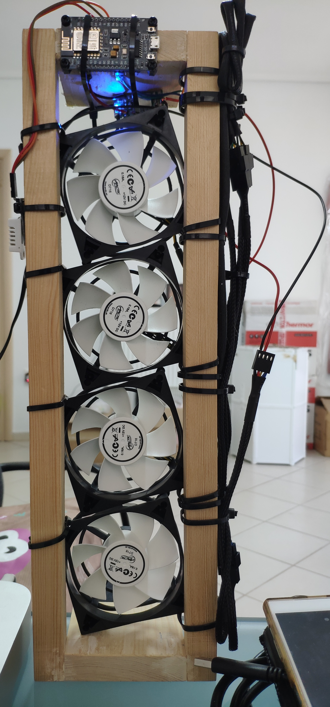

# Fan control
A project using a DC relay to control 4 computer fans

## Tech used
- AutoConnect portal
- DHT 22 library DHTesp
- ESP8266 web server

## Bill of Materials
- 4 x 12V fans (used Arctic F8 Pro)
- 1 x AM2302 chip for temp measurements
- 1 x 12v to 5v USB converter (from a car USB adapter)
- 1 x DC Relay SRD-5VDC-SL-C (note: 5V relay but works with 3.3V)
- 1 x ESP8266 Lolin v3 board
- Various cable adaptors to convert all FAN power to a single 12v rail

## Code
The code in this repo checks the temperature every 15 seconds; if it finds the temp to be below 27C it will stop the fans; if the temp is over 29C it will activate the fans. Having a 2 degree C difference makes sure the fans are not ON/OFF every 15 sec if temperature fluctuates around the control point.

### AutoConnect 
Uses the AutoConnect library that produces a captive portal if it does not connect to a Wifi or on first boot. Allows you to configure a different WiFi access point if the project is moved around.

### Web serving
The internal web server displays a dummy (hello-world) page on `/`. The page on `/temp` shows the measurements and system state, as such:

```
Temperature(C) :
25.20
Humidity(%) :
27.50
Fans:
OFF
```

The measurements are surrounded by a respective <div> so they can be harvested if necessary. 

### Notes
1. A 5V Relay "ideally" wants 5V but can be switched with a 3V3 input. The major snafu here is that you cannot provide 5V power (VCC) and then switch (IN) via a 3V3 rail. It will never switch. You need to use *same VCC and IN* to be able to make it work. In this project, the relay is switched with a 3V3 VCC and IN.
2. Spend a lot of time powering with a 5V current via the VIN (regulated IN). Apparently this is not working correctly on the voltages/amp supplied; the VU (USB 5V in) works like a charm. Noted ;)

 

## Future work
Add a button to control FAN state manually via the web page.
